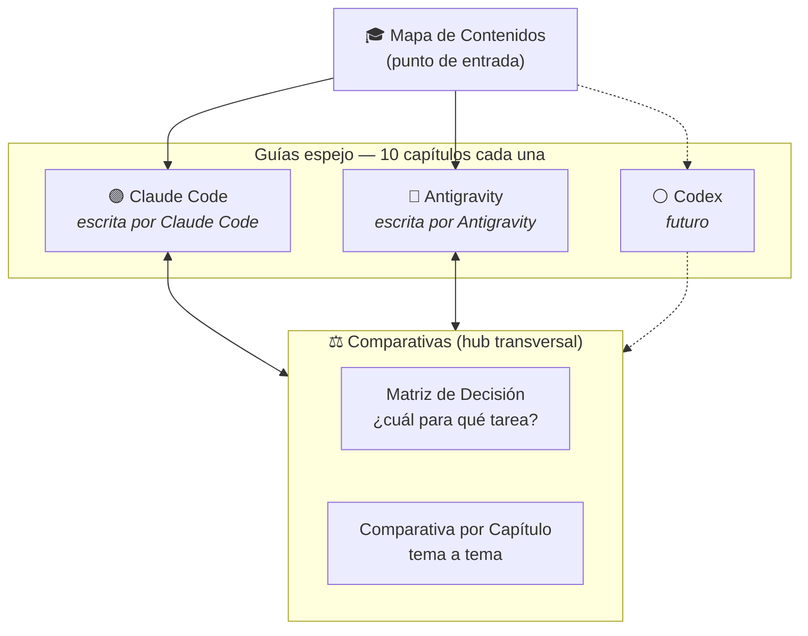
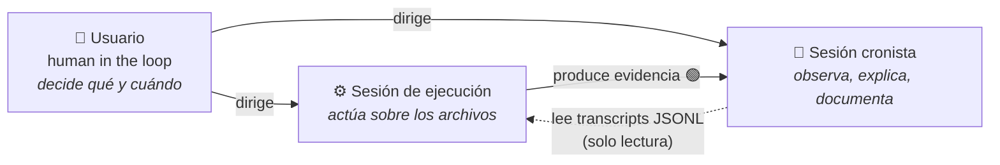

# 🎓 Masterclass de IA Agéntica


> **Una masterclass que se escribe a sí misma.** Cada herramienta de IA agéntica (Claude Code, Antigravity, y las que vengan) documenta **su propia guía de 10 capítulos** trabajando en sesiones reales sobre este mismo vault — y una capa transversal de comparativas responde la pregunta práctica: *¿cuál uso para esta tarea?*

---

## 🧭 La idea en 30 segundos

**Nadie documenta de oídas.** La guía de Claude Code la escribe Claude Code; la de Antigravity, el propio Antigravity. Cada guía enseña su herramienta dos veces: por lo que dice y por **cómo fue construida** (los transcripts de las sesiones que la escribieron son parte de la evidencia).



## 🚀 Empezar aquí

| Si quieres... | Abre... |
|---|---|
| La vista completa del proyecto | [Masterclass IA Agentica - Mapa de Contenidos](Masterclass%20IA%20Agentica%20-%20Mapa%20de%20Contenidos.md) |
| Aprender **Claude Code** desde cero | [Claude Code - Mapa de Contenidos](Claude%20Code/Claude%20Code%20-%20Mapa%20de%20Contenidos.md) |
| Aprender **Antigravity** desde cero | [Antigravity - Mapa de Contenidos](Antigravity/Antigravity%20-%20Mapa%20de%20Contenidos.md) |
| Decidir **cuál herramienta usar** | [Matriz de Decisión](Comparativas/Matriz%20de%20Decision.md) |
| Comparar un tema concreto (memoria, permisos, subagentes...) | [Comparativa por Capítulo](Comparativas/Comparativa%20por%20Capitulo.md) |
| Los términos clave, definidos una vez | [Glosario](Recursos/Glosario.md) |

> [!TIP]
> **La experiencia completa es en Obsidian**: abre esta carpeta como vault (`Archivo → Abrir carpeta como vault`) y usa la vista de grafo — los pares de capítulos espejo se reconocen a simple vista gracias a la convención de nombres.

## 📖 Las guías, capítulo a capítulo

Las dos guías siguen el **mismo esqueleto espejo** — mismo número, mismo tema, distinta herramienta y distinto autor:

| # | Tema espejo | 🟣 Claude Code | 🔵 Antigravity |
|---|---|:---:|:---:|
| 1 | Fundamentos y filosofía | ✅ | ✅ |
| 2 | Arquitectura conceptual | ✅ | ✅ |
| 3 | Contexto y memoria | ✅ | ✅ |
| 4 | Planificación, permisos y flujo | ✅ | ✅ |
| 5 | Git y control de versiones | ✅ | ✅ |
| 6 | Comandos, CLI y superficies | ✅ | ✅ |
| 7 | Extensibilidad: MCP y subagentes | ✅ | ✅ |
| 8 | Portal a Comparativas | ✅ | ✅ |
| 9 | Casos prácticos (sesiones reales) | ✅ | ⏳ *con el usuario* |
| 10 | Mejores prácticas | ⏳ | ✅ |

**Convención de nombres**: `<Herramienta> Capitulo NN - <Tema>.md` — el prefijo evita colisiones de wikilinks, identifica el origen de un vistazo y hace las guías comparables archivo a archivo.

## 🔵🟢🟡⚪ El contrato epistemológico

Todo el contenido técnico del vault lleva un marcador de certeza — y el 🟢 es **relativo al autor de cada guía**:

| Marcador | Significa | Ejemplo |
|---|---|---|
| 🔵 | Documentado oficialmente por el fabricante | "Claude Code soporta MCP" |
| 🟢 | **Observado en una sesión real del autor de esa guía** | La auditoría forense de 6 invocaciones de un subagente, leída del transcript JSONL |
| 🟡 | Simplificación pedagógica (modelo mental útil) | "MCP es el USB-C de la IA" |
| ⚪ | No público — se declara, no se especula | El expediente `claude mcp serve` |

Esta distinción es la columna vertebral del proyecto: entender una herramienta bien significa también saber **quién verificó cada afirmación y cómo**.

## 🤝 Cómo se construye: tres cerebros y territorios



Cada agente escribe **solo en su territorio** — y nadie borra contenido de otro:

<details>
<summary><b>🗺️ Territorios de escritura (clic para desplegar)</b></summary>

| Agente | Escribe en | Prohibido |
|---|---|---|
| **Claude Code** (cronista) | `Claude Code/`, `Recursos/`, `Comparativas/` (estructura + su columna), mapa raíz | Columnas ajenas; `Antigravity/` |
| **Antigravity** | `Antigravity/`, su columna y notas firmadas en `Comparativas/` | Todo lo demás |
| **Codex** (futuro) | `Codex/`, su columna y notas firmadas | Todo lo demás |
| **Usuario** | Todo | — (arbitra conflictos) |

En las tablas comparativas, cada herramienta edita **solo su columna**; los aportes fuera de tabla van en callouts firmados (`> [!note] Nota de Antigravity 🟢`).

</details>

<details>
<summary><b>📁 Estructura del vault (clic para desplegar)</b></summary>

```
Masterclass IA Agentica - Mapa de Contenidos.md   ← punto de entrada
├── Comparativas/
│   ├── Matriz de Decision.md          ← ¿cuál para qué tarea? (documento vivo)
│   └── Comparativa por Capitulo.md    ← tema a tema, columna por herramienta
├── Claude Code/
│   ├── Claude Code - Mapa de Contenidos.md
│   └── Capitulos/Claude Code Capitulo 01..10 - *.md
├── Antigravity/
│   ├── Antigravity - Mapa de Contenidos.md
│   └── Capitulos/Antigravity Capitulo 01..10 - *.md
├── Recursos/
│   ├── Glosario.md                    ← términos agénticos transversales
│   ├── Plantilla - Como añadir una herramienta.md
│   └── Mapa Mental · Plan de Estudio · Documentos Oficiales (al cierre)
└── .claude/                           ← agentes, reglas y settings del propio vault
    └── agents/commit-es.md, revisor-capitulos.md
```

</details>

<details>
<summary><b>🧬 Meta: el vault se construye con lo que enseña (clic para desplegar)</b></summary>

Este repositorio no solo documenta herramientas agénticas — **las usa en su propia construcción**, y esa evidencia alimenta los capítulos:

- Los **commits** los redacta un subagente real (`commit-es`, en `.claude/agents/`) que audita el diff y propone el mensaje; la ejecución queda en manos del orquestador. Seis de sus invocaciones fueron auditadas forensemente desde el transcript JSONL y el hallazgo está documentado en el Capítulo 7 de Claude Code (§7.6).
- La **revisión de capítulos** la hace otro subagente de solo lectura (`revisor-capitulos`).
- Grandes reestructuraciones (como la unificación de nomenclatura de 2026-07-15) se ejecutan bajo **`/goal`** — el modo de ejecución autónoma con criterio de término.
- El **gap de visibilidad** entre superficies (app ↔ CLI) y su workaround (leer los JSONL de `~/.claude/projects/`) está documentado en el Capítulo 6 §6.6 — descubierto porque este mismo proyecto lo sufrió.

</details>

## ➕ ¿Quieres añadir una herramienta?

El proceso completo está en la [Plantilla — Cómo añadir una herramienta](Recursos/Plantilla%20-%20Como%20a%C3%B1adir%20una%20herramienta.md): crear su territorio, su MOC espejo, su columna en Comparativas — y dejar que **la propia herramienta** escriba su guía, capítulo a capítulo, con confirmación humana entre medias.

---

<p align="center"><i>Construida en vivo, en sesiones reales, con evidencia de primera mano — porque la mejor forma de documentar un agente es dejar que se documente a sí mismo (con un humano al volante).</i></p>
